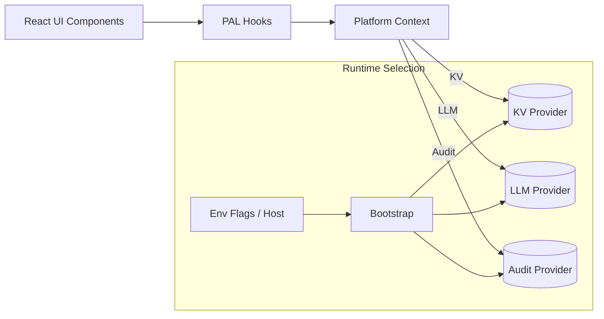

# Platform Abstraction Layer (PAL)

A minimal, provider-driven layer to run the app with or without Spark. It preserves the same UI and lets you switch between in-memory/dev mocks, on‑prem LLM gateways, and future enterprise backends without rewriting components.

## Goals

- Keep the current React UI as‑is (components remain compatible).
- Decouple from Spark by routing through stable PAL interfaces (KV, LLM, Audit).
- Enable pilots without Spark (mock/in‑memory), and on‑prem LLMs via a simple gateway.
- Switch providers via environment flags or a small bootstrap function.

## Overview

PAL defines small interfaces and a React context. Components use hooks (useStore, useLLM, useAudit) instead of vendor SDKs. The bootstrap selects the provider (on‑prem > host‑provided > dev mock) at runtime.



## Interfaces

```ts
// core.ts (shape, not a final file path)
export type KVValue = unknown

export interface KV {
  get<T = KVValue>(key: string, fallback?: T): T
  set<T = KVValue>(key: string, value: T): void
  subscribe<T = KVValue>(key: string, cb: (val: T) => void): () => void
}

export interface LLM {
  llm(prompt: string, model?: string): Promise<string>
}

export interface AuditEvent {
  ts: number
  type: string
  detail?: Record<string, unknown>
}

export interface Audit {
  log(evt: AuditEvent): void
  all(): AuditEvent[]
}

export interface Platform {
  kv: KV
  llm: LLM
  audit: Audit
}
```

## Default Providers (in repo)

- Dev mock LLM (only if no provider present): `src/lib/devSparkMock.ts`
  - Sets `window.spark` with a deterministic fake LLM to keep UI functional in development.
- On‑prem LLM gateway scaffold: `src/lib/onPremSparkProvider.ts`
  - `registerOnPremSpark({ endpoint, token?, model? })` registers `window.spark` to call your internal gateway.
- Bootstrap wiring (dynamic): `src/main.tsx`
  - Chooses on‑prem provider if `VITE_ONPREM_LLM_ENDPOINT` is set; otherwise loads the dev mock in development; never overrides a host‑provided `window.spark`.

> Note: The app currently uses Spark KV hooks for state. PAL can coexist while you migrate. See the migration guide below.

## React Context + Hooks (example shape)

```ts
// platform/context.tsx (reference design)
import React, { createContext, useContext, useMemo } from 'react'
import type { Platform } from './core'

const Ctx = createContext<Platform | null>(null)

export function PlatformProvider({ platform, children }: { platform: Platform; children: React.ReactNode }) {
  const value = useMemo(() => platform, [platform])
  return <Ctx.Provider value={value}>{children}</Ctx.Provider>
}

export function usePlatform(): Platform {
  const ctx = useContext(Ctx)
  if (!ctx) throw new Error('Platform context missing')
  return ctx
}
```

```ts
// platform/hooks.ts (reference design)
import { useEffect, useState } from 'react'
import { usePlatform } from './context'

export function useStore<T>(key: string, initial: T): [T, (v: T)=>void] {
  const { kv } = usePlatform()
  const [val, setVal] = useState<T>(() => kv.get<T>(key, initial))
  useEffect(() => kv.subscribe<T>(key, setVal), [key, kv])
  const set = (v: T) => kv.set<T>(key, v)
  return [val, set]
}

export function useLLM() {
  const { llm } = usePlatform()
  return llm.llm
}
```

## Bootstrap and Env Guards (implemented)

- File: `src/main.tsx`
  - If `VITE_ONPREM_LLM_ENDPOINT` is present, dynamically import and call `registerOnPremSpark`.
  - Else if in development and no `window.spark` exists, load `devSparkMock`.
  - If a host page sets `window.spark` first, the app uses that and skips both imports.

```ts
// excerpt (already wired in src/main.tsx)
const endpoint = import.meta.env?.VITE_ONPREM_LLM_ENDPOINT
const token = import.meta.env?.VITE_ONPREM_LLM_TOKEN
if (!w.spark && endpoint) {
  import('./lib/onPremSparkProvider').then(m => m.registerOnPremSpark({ endpoint, token }))
} else if (!w.spark && import.meta.env?.DEV) {
  import('./lib/devSparkMock')
}
```

## On‑Prem Gateway Contract

- Request: `POST <endpoint>` with `{ prompt: string, model?: string }`
- Response (preferred): `{ output: string }` JSON
- Response (fallback): text body with the model’s output
- Auth: Use server‑side session/cookie or `Authorization: Bearer <token>` (token configured via `VITE_ONPREM_LLM_TOKEN`).

The scaffold handles both JSON and text responses.

## Migration Guide (incremental)

- Replace Spark KV with PAL store:
  - Before: `const [x, setX] = useKV<T>('key', initial)`
  - After: `const [x, setX] = useStore<T>('key', initial)`
- Replace `spark.llm` with PAL:
  - Before: `const o = await spark.llm(prompt, 'gpt-4o')`
  - After: `const llm = useLLM(); const o = await llm(prompt, 'any')`
- Keep UI unchanged; migrate feature by feature.
- Optionally, create a Spark‑compat shim to reduce churn (export `useKV` and `llm` from PAL under the same names).

## Deployment Matrix

- Dev (no env, no host spark):
  - Dev mock LLM is installed; UI always responds; audit logs still populate.
- Pilot with on‑prem LLM:
  - Set `VITE_ONPREM_LLM_ENDPOINT` (and optionally `VITE_ONPREM_LLM_TOKEN`).
  - Assistants use your gateway; no Spark required.
- Hosted with Spark or other provider:
  - Provide `window.spark` before the app loads; the app respects it.

## Validation Checklist

- Ask the Operations Copilot a question:
  - You see a model response (mock or on‑prem).
  - AI audit events record prompt and response.
  - AI Audit Trail shows the conversation (from KV or reconstructed from audit).
- Optional: Use the AI Audit page “Refresh” and “Sample now” to confirm live updates.

## Existing Scaffold in This Repo

- `src/lib/onPremSparkProvider.ts`: on‑prem provider registration.
- `src/lib/devSparkMock.ts`: dev mock for LLM.
- `src/main.tsx`: env‑guarded bootstrap wiring.

## Next Steps (optional)

- Add persistent KV and audit providers (e.g., REST/Redis/Postgres) behind the PAL interfaces.
- Provide a Spark‑compat shim module so current imports can be redirected with minimal code changes.
- Add streaming support to the LLM provider and a progressive UI for token streams.

---

This PAL keeps the UI stable while enabling Spark‑less pilots and client‑specific configurations with minimal risk and low technical debt.
